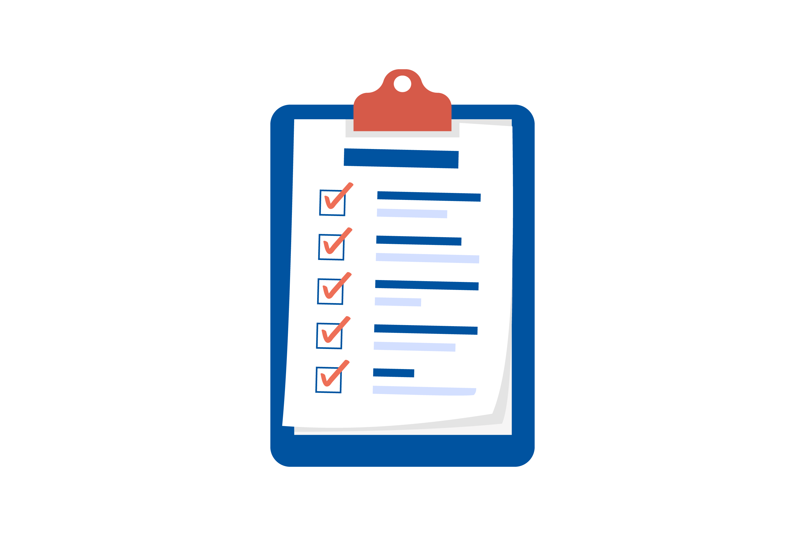

# TODOA ✅

A comprehensive Task 📋 Manager Flutter application.

## Project Overview

Welcome to Todoa, a sophisticated and intuitive 🤩 todo and task manager mobile 📱 application crafted with the robust combination of Flutter and Firebase 💙💛.

### Key Features

- **Intuitive Interface:** Streamlined and user-friendly design for a seamless task management experience.

- **Firebase Integration:** Real-time synchronization and cloud storage for secure and accessible data.

- **Task Prioritization:** Easily prioritize tasks to stay focused on what matters most.

- **Deadline Reminders:** Set and receive reminders to ensure timely completion of tasks.

- **Cross-Platform Compatibility:** Built with Flutter, ensuring a consistent and responsive experience across iOS and Android devices.

## Getting Started

Follow these simple steps to get started with Todoa:

1. **Clone the Repository:**
   ```bash
   git clone https://github.com/hafiz-abdul-rehman/todoa.git

2. **Navigate to Project Directory:**
   ```bash
   cd todoa

3. **Install Dependencies:**
   ```bash
   flutter pub get

4. **Run the App:**
   ```bash
   flutter run

## Issues and Feedback
Please report any issues or provide feedback through our email. (abdulrehmanhafiz7800@gmail.com)

# REGARDS

